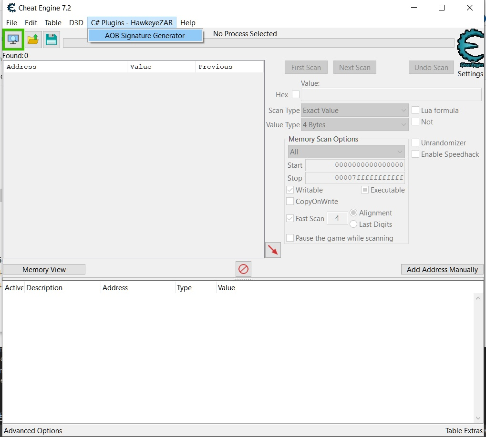
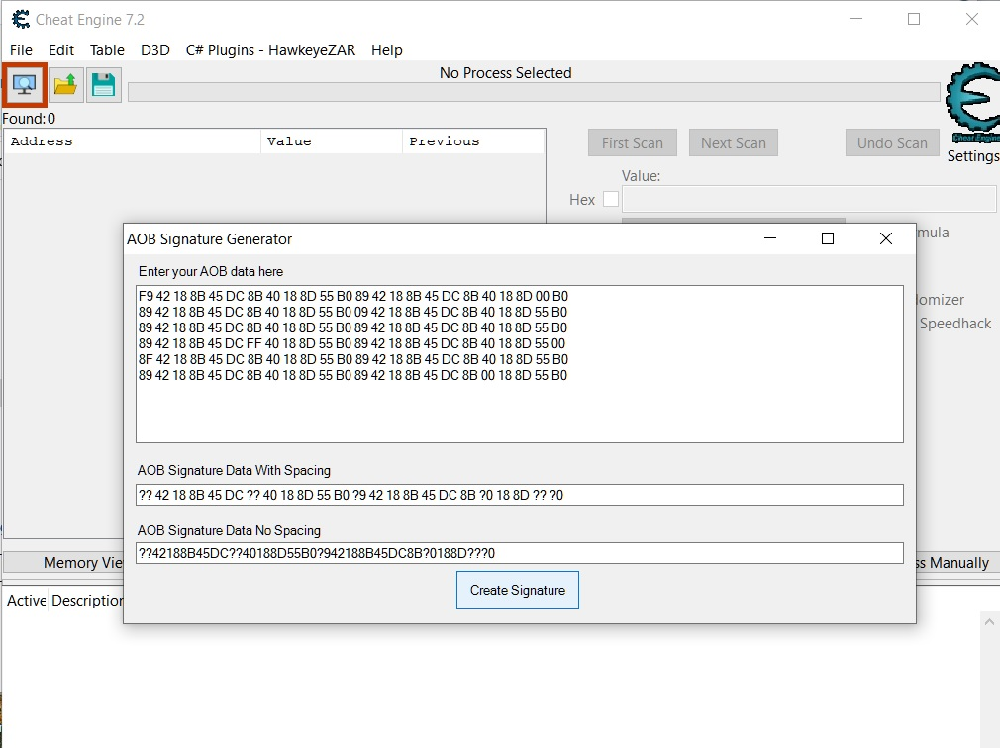

Misc Util plugins for CheatEngine - C# .Net
======================================================

Written in C# using WindowsForms and .Net.

This dll works with CheatEngine, a debugger and memory hacker used for games.
Currently there are two utils, an AOB Signature Generator and a util to modify Cheat Engines Screen

I will try to add more features to this plugin over time.

AOB Signature Generator
------------------------
*** I renamed the menu to Misc Utils ***

Change Window Display Options
------------------------

